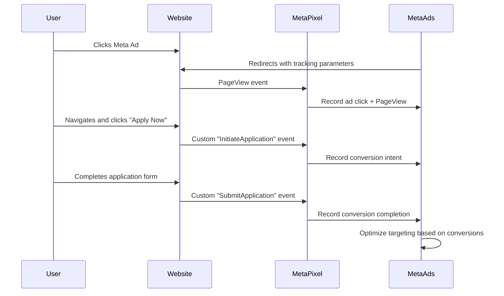
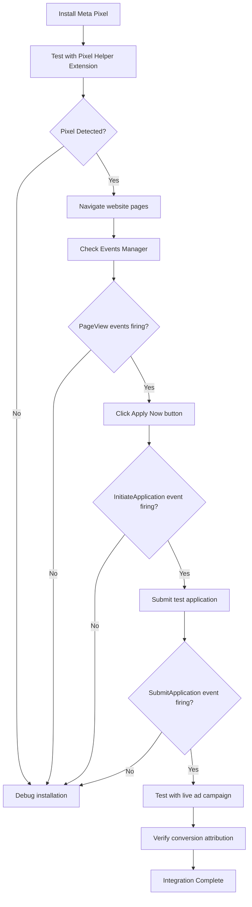

# Meta Pixel Integration Design

## Overview

This design document outlines the integration of Meta Pixel (formerly Facebook Pixel) into the Dream Launcher Movement website to enable tracking of user interactions, optimize Meta Ads campaigns, and facilitate conversion tracking for the "Apply Now" call-to-action.

## Objectives

- Enable Meta Pixel tracking across the website to monitor user behavior and ad campaign performance
- Track key conversion events, specifically the "Apply Now" button click and application form submission
- Support Meta Ads campaign optimization by providing conversion data for users coming from Meta advertisements
- Enable retargeting capabilities for users who interact with the website but do not complete applications
- Provide analytics data to improve ad targeting and measure return on ad spend

## Scope

### In Scope
- Meta Pixel base code installation in the website
- Standard event tracking for page views
- Custom event tracking for "Apply Now" button clicks
- Conversion tracking for application form submissions
- Event parameter configuration for enhanced tracking
- User privacy compliance considerations
- Testing and verification procedures

### Out of Scope
- Meta Ads campaign creation and management
- Meta Business Manager configuration
- Advanced e-commerce tracking (not applicable to this website)
- Server-side event tracking via Conversions API
- Custom audience creation within Meta Ads Manager

## Technical Architecture

### Component Integration Points

| Component | Integration Type | Purpose |
|-----------|-----------------|---------|
| HTML Head Section | Script Injection | Load Meta Pixel base code globally |
| Application Router | Event Tracking | Track page navigation and views |
| Apply Page | Event Tracking | Track application form access |
| Apply Form Component | Conversion Tracking | Track form submission success |
| Navigation CTA Buttons | Event Tracking | Track "Apply Now" button clicks |

### Data Flow



## Implementation Strategy

### Pixel Installation

The Meta Pixel will be installed through two complementary approaches:

**Approach 1: Direct Script Injection**
- Insert Meta Pixel base code directly into the HTML head section
- Ensures pixel loads on every page before any user interaction
- Provides immediate tracking capability

**Approach 2: React Component Integration**
- Create a dedicated Meta Pixel service utility
- Initialize pixel within the main App component
- Provides programmatic control over event tracking

### Event Tracking Strategy

| Event Name | Event Type | Trigger Point | Purpose |
|------------|-----------|---------------|---------|
| PageView | Standard | Every page load | Track overall site traffic and navigation patterns |
| InitiateApplication | Custom | "Apply Now" button click | Track conversion funnel entry point |
| SubmitApplication | Custom | Successful form submission | Track completed conversions |
| Lead | Standard | Application form submission | Standard Meta conversion event for lead generation |

### Event Parameters

Each tracked event will include contextual parameters to enhance analytics:

| Parameter | Data Type | Description | Example |
|-----------|-----------|-------------|---------|
| content_name | String | Descriptive name of the conversion | "DLM Application Form" |
| content_category | String | Category of the action | "Application" |
| value | Number | Monetary value (if applicable) | 0 |
| currency | String | Currency code | "PKR" |
| source | String | Traffic source identifier | "meta_ad", "organic" |

## Configuration Requirements

### Environment Variables

| Variable Name | Purpose | Storage Location | Example Value |
|--------------|---------|------------------|---------------|
| VITE_META_PIXEL_ID | Meta Pixel identifier | .env file | "1234567890123456" |

### Meta Business Manager Setup Prerequisites

Before implementation, the following must be completed in Meta Business Manager:

- Meta Pixel creation within Events Manager
- Pixel ID acquisition
- Domain verification for the DLM website
- Event setup configuration for custom events
- Test event creation for validation

## Privacy and Compliance Considerations

### Data Protection Principles

- User consent mechanism should be considered for tracking in regions requiring explicit consent
- Meta Pixel respects user privacy settings and browser Do Not Track preferences
- No personally identifiable information should be sent through custom event parameters
- Compliance with data protection regulations in target markets

### Privacy Policy Updates

The website's privacy policy should be updated to reflect:

- Use of Meta Pixel for analytics and advertising purposes
- Types of data collected through the pixel
- How collected data is used to improve user experience
- User rights regarding tracking and data collection
- Link to Meta's data policy

## Tracking Verification Strategy

### Testing Approach

| Test Type | Method | Success Criteria |
|-----------|--------|------------------|
| Pixel Installation | Meta Pixel Helper browser extension | Green indicator showing pixel active |
| PageView Events | Events Manager real-time view | Events appear within 20 seconds |
| Custom Events | Test Event Code feature | All custom events recorded correctly |
| Conversion Attribution | Create test ad campaign | Conversions attributed to correct campaigns |
| Cross-browser Testing | Multiple browsers and devices | Consistent tracking across platforms |

### Verification Workflow



## User Journey Integration

### Ad Campaign to Application Flow

**Step 1: User sees Meta Ad**
- Meta Ads platform displays targeted advertisement
- Ad creative includes compelling call-to-action
- Click destination is website homepage or dedicated landing page

**Step 2: User arrives on website**
- Meta Pixel fires PageView event immediately
- Tracking parameters preserved in URL
- User sees website content and value proposition

**Step 3: User clicks "Apply Now"**
- User clicks any "Apply Now" button throughout the website
- Meta Pixel fires InitiateApplication custom event
- User is redirected to /apply route

**Step 4: User completes application**
- User fills out application form completely
- Upon successful submission, Meta Pixel fires:
  - SubmitApplication custom event
  - Lead standard event
- User receives confirmation and is redirected to password setup

### Conversion Funnel Analytics

The Meta Pixel will enable tracking of the following conversion funnel:

```mermaid
funnel
    Ad Impression
    Ad Click
    PageView Event
    Apply Now Click (InitiateApplication)
    Form Completion (SubmitApplication/Lead)
```

This funnel data will help:
- Identify drop-off points in the conversion process
- Optimize ad creative and targeting
- Calculate cost per lead and return on ad spend
- Improve website user experience

## Integration Points Detail

### Global Pixel Initialization

The Meta Pixel base code must be inserted into the HTML document head section before any other scripts execute. This ensures that:

- The pixel loads before user interaction occurs
- Page view events are captured accurately
- Cookie placement happens at the earliest opportunity
- Ad platform attribution is maintained correctly

### React Application Integration

Within the React application structure:

**App Component Level**
- Initialize Meta Pixel service when application mounts
- Configure pixel with environment-specific ID
- Set up automatic page view tracking on route changes

**Navigation Components**
- Track "Apply Now" button clicks in navigation bar
- Track CTA button clicks in hero sections
- Track any promotional banners leading to application

**Application Form Component**
- Track form access (already covered by PageView)
- Track successful submission before redirect
- Include relevant parameters like application ID if needed

### Event Firing Timing

| Event | Timing Constraint | Rationale |
|-------|------------------|-----------|
| PageView | Immediately on page load | Capture all traffic accurately |
| InitiateApplication | On button click, before navigation | Ensure event fires even if navigation is fast |
| SubmitApplication | After successful API response | Only track actual successful submissions |

## Error Handling and Fallback

### Pixel Load Failure

If Meta Pixel script fails to load:
- Website functionality must not be impacted
- Graceful degradation ensures user experience remains intact
- Console warnings logged for debugging purposes
- No blocking errors presented to users

### Event Tracking Failure

If event tracking fails:
- Application submission proceeds normally
- Error logged to console for investigation
- User is not notified of tracking failure
- Conversion is completed regardless of tracking status

## Monitoring and Maintenance

### Ongoing Verification

- Regular checks using Meta Pixel Helper extension
- Monthly review of Events Manager data quality
- Quarterly audit of event firing accuracy
- Annual review of privacy compliance requirements

### Performance Monitoring

- Monitor impact of pixel script on page load times
- Ensure pixel does not block critical rendering path
- Verify asynchronous loading is maintained
- Track any user-reported issues related to tracking

## Success Metrics

### Technical Success Indicators

| Metric | Target | Measurement Method |
|--------|--------|-------------------|
| Pixel Load Success Rate | >99% | Events Manager diagnostics |
| PageView Event Accuracy | >95% | Compare to Google Analytics data |
| Custom Event Fire Rate | >90% | Test Event verification |
| Event Attribution Accuracy | >85% | Compare ad platform data with submissions |

### Business Success Indicators

| Metric | Purpose | Evaluation Period |
|--------|---------|------------------|
| Cost per Lead | Measure ad campaign efficiency | Monthly |
| Conversion Rate | Track application completion from ads | Weekly |
| Return on Ad Spend | Calculate campaign profitability | Monthly |
| Audience Retargeting Performance | Measure re-engagement success | Bi-weekly |

## Dependencies

### External Dependencies

- Meta Pixel ID from Meta Business Manager
- Domain verification in Meta Business Manager
- Active Meta Ads account with appropriate permissions
- Meta Events Manager access for verification

### Internal Dependencies

- Website deployment to production environment
- Access to modify HTML head section or main application component
- Ability to add environment variables to hosting platform
- Access to analytics and monitoring tools

## Risk Assessment

| Risk | Impact | Likelihood | Mitigation Strategy |
|------|--------|-----------|---------------------|
| Pixel script blocked by ad blockers | Medium | High | Accept as limitation; most converters won't use ad blockers |
| Privacy regulations preventing tracking | High | Medium | Implement consent management if required by target market |
| Incorrect event firing | High | Low | Thorough testing and validation before launch |
| Performance degradation | Medium | Low | Asynchronous loading and performance monitoring |
| Data quality issues | Medium | Medium | Regular audits and cross-platform verification |

## Timeline Considerations

The implementation can be structured in phases:

**Phase 1: Base Pixel Installation**
- Install Meta Pixel base code
- Verify PageView events firing
- Duration: 1 development session

**Phase 2: Custom Event Implementation**
- Add InitiateApplication event tracking
- Add SubmitApplication event tracking
- Duration: 1-2 development sessions

**Phase 3: Testing and Validation**
- Comprehensive testing across browsers
- Event verification in Events Manager
- Test event code validation
- Duration: 1 development session

**Phase 4: Production Deployment and Monitoring**
- Deploy to production environment
- Monitor initial event flow
- Verify ad campaign attribution
- Duration: Ongoing monitoring

## Future Enhancement Opportunities

While out of scope for initial implementation, future enhancements could include:

- Server-side event tracking via Meta Conversions API for improved accuracy
- Advanced matching parameters for better user attribution
- Custom audience creation automation
- Integration with other analytics platforms for cross-platform insights
- A/B testing framework integration for conversion optimization
- Dynamic event parameters based on user behavior patterns
